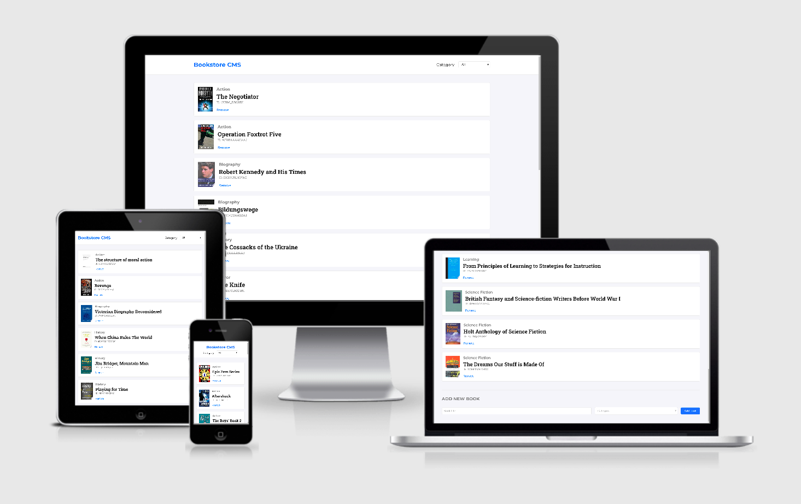

## React-Redux Bookstore

Bookstore management tool with React and Redux.

[](https://www.mauriciorobayo.com/react-redux-bookstore)

## Live Demo

[Live Demo Link](https://www.mauriciorobayo.com/react-redux-bookstore)

## Built With

This project was bootstrapped with [Create React App](https://github.com/facebook/create-react-app).

## Getting Started

To get a local copy up and running follow these simple example steps:

```
git clone https://github.com/MauricioRobayo/react-redux-bookstore
cd react-redux-bookstore
npm install
```

### Prerequisites

- Nodejs version >=12.x.

### Usage

`npm start`

Runs the app in the development mode.<br />
Open [http://localhost:3000](http://localhost:3000) to view it in the browser.

The page will reload if you make edits.<br />
You will also see any lint errors in the console.

### Deployment

`npm build`

Builds the app for production to the `build` folder.<br />
It correctly bundles React in production mode and optimizes the build for the best performance.

The build is minified and the filenames include the hashes.<br />
Your app is ready to be deployed!

See the section about [deployment](https://facebook.github.io/create-react-app/docs/deployment) for more information.

## Contributors

- Github: [@MauricioRobayo](https://github.com/MauricioRobayo)
- Linkedin: [linkedin](www.linkedin.com/in/MauricioRobayo)

## 🤝 Contributing

Contributions, issues and feature requests are welcome!

## Show your support

Give a ⭐️ if you like this project!

## Acknowledgments

[Project description](https://github.com/microverseinc/project-redux-bookstore/)

## 📝 License

This project is [MIT](LICENSE) licensed.
